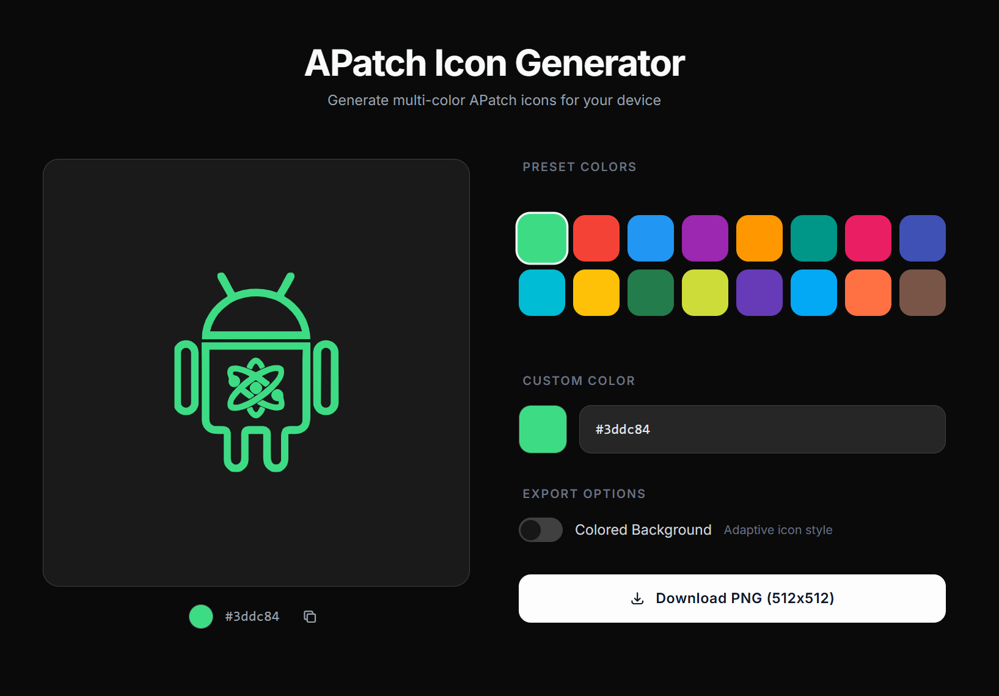

# APatch Icon Generator

> **使用 APatch，每个人都值得拥有不同颜色的头像。**

简体中文 | [English](README.md)

为 [APatch](https://github.com/bmax121/APatch) 生成任意颜色的图标。选择预设配色或自定义颜色，实时预览并一键导出 512×512 PNG。




## ✨ 功能

- 🎨 **16 套预设配色** — Material Design 色系 + APatch 原始绿 + 更多
- 🖌️ **自定义颜色** — 原生取色器 + HEX 输入，实时预览
- 🌙 **自适应背景** — 可选深色背景层（Android 自适应图标风格）
- 🌓 **夜间模式** — 自动跟随系统偏好或手动切换
- 📱 **响应式设计** — 手机 / 平板 / 桌面全适配
- ⚡ **纯前端实现** — 无需后端，打开即用

## 🛠 技术栈

| 技术 | 用途 |
|------|------|
| [Astro](https://astro.build) | 静态站点框架 |
| [Tailwind CSS v4](https://tailwindcss.com) | 原子化样式 |

## 🚀 快速开始

```bash
# 安装依赖 (npm / pnpm / yarn 均可)
pnpm install

# 启动开发服务器
pnpm run dev

# 构建生产版本
pnpm run build
```

## 📄 License

[GPL-3.0](LICENSE)

## 🙏 致谢

- [APatch](https://github.com/bmax121/APatch) by bmax121 — 图标矢量数据来源

---

<p align="center">
  &copy; Matsuzaka Yuki · <a href="https://github.com/matsuzaka-yuki">GitHub</a>
</p>
